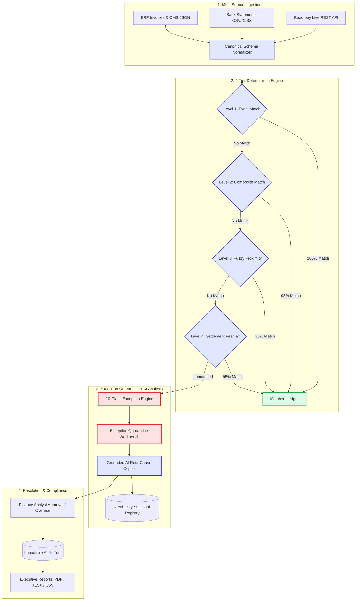

# LedgerIQ ⚖️⚡
> **Enterprise AI Finance Controller & Multi-Source Reconciliation Platform**  
> *Reconcile faster. Explain every rupee. Resolve exceptions with confidence.*

[](https://www.python.org/)
[](https://fastapi.tiangolo.com/)
[](https://react.dev/)
[](https://www.typescriptlang.org/)
[](https://vitejs.dev/)
[](https://tailwindcss.com/)
[](https://www.sqlalchemy.org/)
[](https://docs.pytest.org/)
[](#-verified-benchmarks--performance)
[](LICENSE)

---

## 🌐 Live Deployments & Demos

| Resource | Link | Description |
| :--- | :--- | :--- |
| 🚀 **Live Web Application** | **[ledgeriq-one.vercel.app](https://ledgeriq-one.vercel.app/)** | Production Frontend running on Vercel |
| ⚡ **Live Backend API** | **[ledgeriq-backend-8l0l.onrender.com](https://ledgeriq-backend-8l0l.onrender.com/)** | High-performance FastAPI Service running on Render |
| 📖 **Interactive Swagger Docs** | **[ledgeriq-backend-8l0l.onrender.com/docs](https://ledgeriq-backend-8l0l.onrender.com/docs)** | OpenAPI 3.0 Interactive API Explorer |
| 🎥 **Video Walkthrough Demo** | **[YouTube Demo (7-Min Pitch)](https://www.youtube.com/watch?v=NHntelTYa1w)** | End-to-end architecture & live UI demonstration |
| 💻 **GitHub Repository** | **[github.com/GiridharLavhale/LedgerIQ](https://github.com/GiridharLavhale/LedgerIQ)** | Full open-source codebase & test suite |
| 👤 **Author & Maintainer** | **[Girish Lavhale](https://github.com/GiridharLavhale)** | Computer Science & Engineering |

> 🔑 **Pre-Seeded Demo Credentials**: `admin@ledgeriq.io` &nbsp;|&nbsp; Password: `admin123`  
> *(You can also sign up with a new account or click **"Run 100-Record Benchmark"** in the top navigation bar for 1-click instant data seeding).*

---

## 📑 Table of Contents
- [Executive Overview](#-executive-overview)
- [The Problem: The FinOps Triple Ledger Dilemma](#-the-problem-the-finops-triple-ledger-dilemma)
- [The LedgerIQ Solution](#-the-ledgeriq-solution)
- [Core Workflow Architecture](#-core-workflow-architecture)
- [4-Tier Deterministic Reconciliation Hierarchy](#-4-tier-deterministic-reconciliation-hierarchy)
- [Automated Exception Management & 4-Pane Comparative Ledger](#-automated-exception-management--4-pane-comparative-ledger)
- [Grounded AI Finance Copilot & Multi-Agent Layer](#-grounded-ai-finance-copilot--multi-agent-layer)
- [Razorpay Integration & Data Connectors](#-razorpay-integration--data-connectors)
- [Enterprise Application Suite](#-enterprise-application-suite)
- [System Architecture](#-system-architecture)
- [Technology Stack](#-technology-stack)
- [Security, Governance & RBAC](#-security-governance--rbac)
- [Project Directory Structure](#-project-directory-structure)
- [Local Development Setup](#-local-development-setup)
- [Environment Configuration](#-environment-configuration)
- [Verified Benchmarks & Performance](#-verified-benchmarks--performance)
- [Limitations & Engineering Roadmap](#-limitations--engineering-roadmap)
- [Author & License](#-author--license)

---

## 🌟 Executive Overview

In high-volume digital commerce, financial operations (FinOps) teams are tasked with maintaining ledger accuracy across heterogeneous systems: **Payment Gateways** (Razorpay, Stripe), **Core Bank Statements** (HDFC, ICICI, SBI), and **Internal ERP / Invoicing Systems**.

As transaction volumes scale into thousands or millions of daily events, financial operations break down due to:
1. **Schema Fragmentation**: Every gateway, bank statement, and order ledger formats dates, IDs, and amounts differently.
2. **Fee & Tax Deductions**: Gateways deduct MDR fees (e.g., 2%) and GST on MDR (18%) at source before settling to bank accounts. A naive ₹10,000 charge lands as a ₹9,764 settlement line.
3. **Settlement Timing Delays**: Gateways settle on T+1/T+2 cycles and aggregate multiple transactions into lump-sum payouts.
4. **The LLM Math Fallacy**: General Large Language Models hallucinate numbers, miscalculate sums, and cannot be trusted with mathematical ledger reconciliation.

**LedgerIQ** solves this with a **Two-Tier Architecture**:
- **Tier 1: 100% Deterministic Financial Core**: Hard mathematical matching, 4-tier reconciliation algorithms, exact fee/tax decomposition, zero LLM math, and immutable audit logs.
- **Tier 2: Grounded Agentic AI Layer**: Multi-provider AI (Gemini, Groq, OpenRouter, or zero-key local fallback) equipped with **read-only SQL database tools** to investigate discrepancies, produce root-cause explanations, and assist finance analysts via natural language.

---

## ⚠️ The Problem: The FinOps Triple Ledger Dilemma

```
 ┌───────────────────────────┐      ┌───────────────────────────┐      ┌───────────────────────────┐
 │   Internal Order Ledger   │      │   Razorpay Gateway API    │      │    Bank Account Statement │
 │ (e.g., ₹10,000 Order)     │      │ (Gross ₹10k, Fee ₹236)    │      │ (Net ₹9,764 Payout Line)  │
 └─────────────┬─────────────┘      └─────────────┬─────────────┘      └─────────────┬─────────────┘
               │                                  │                                  │
               └──────────────────────────────────┼──────────────────────────────────┘
                                                  ▼
                              ┌───────────────────────────────────────┐
                              │       The Three-Way Mismatch:         │
                              │ • Missing gateway settlement record?  │
                              │ • Overcharged MDR or incorrect GST?   │
                              │ • T+2 timing delay or bank drop?      │
                              │ • ₹236 discrepancy unaccounted for?   │
                              └───────────────────────────────────────┘
```

When FinOps teams reconcile manually in spreadsheets:
- **Discrepancy Resolution Latency**: Takes 3 to 7 days per billing cycle.
- **Revenue Leakage**: Unclaimed gateway refunds, double-counted fees, and under-settled payouts go unnoticed.
- **Audit Risk**: Lack of an immutable trail linking raw bank statements to reconciled ledger records.

---

## 💡 The LedgerIQ Solution

LedgerIQ automates the entire FinOps lifecycle:

1. **Canonical Ledger Ingestion**: Ingests Razorpay REST API data, CSV/XLSX bank statements, and ERP invoices into a normalized schema.
2. **4-Tier Mathematical Matching Engine**: Executes exact, composite, fuzzy, and settlement-aware fee decomposition algorithms at over **3,780 transactions/second**.
3. **Discrete 10-Class Exception Quarantine**: Automatically tags anomalies into exact financial categories (`AMOUNT_MISMATCH`, `FEE_DISCREPANCY`, `MISSING_SETTLEMENT`, etc.).
4. **Grounded AI Root-Cause Investigation**: Employs an AI Finance Copilot that queries database records through strict read-only tools to explain discrepancies without hallucination.
5. **Human-in-the-Loop Workbench**: Provides finance analysts with 4-pane comparative ledger views, single-click resolution actions, and tamper-evident audit trails.
6. **Executive Export Center**: Generates formal reconciliation certificates, Excel reports, and PDF summaries for CFO review and external audits.

---

## 🔄 Core Workflow Architecture



---

## ⚡ 4-Tier Deterministic Reconciliation Hierarchy

Reconciliation math is **100% deterministic**. LedgerIQ never delegates arithmetic calculations to language models. The 4-tier pipeline runs sequentially:

```
┌──────────────────────────────────────────────────────────────────────────────────────────────────┐
│                               4-TIER RECONCILIATION PIPELINE                                     │
├───────┬──────────────────────┬─────────────────────────────────────────────────┬─────────────────┤
│ Tier  │ Strategy Name        │ Matching Criteria                               │ Confidence Rate │
├───────┼──────────────────────┼─────────────────────────────────────────────────┼─────────────────┤
│ Tier 1│ Exact Identifier     │ Exact match on external transaction ID / ref ID │ 100.0%          │
│ Tier 2│ Composite Strict     │ Reference Match + Currency + Exact Amount + Date│ 98.0%           │
│ Tier 3│ Fuzzy Proximity      │ Levenshtein String Similarity >= 0.78 + Window  │ 85.0%           │
│ Tier 4│ Settlement Fee & Tax │ Gross - MDR (2%) - GST on MDR (18%) = Net Match │ 95.0%           │
└───────┴──────────────────────┴─────────────────────────────────────────────────┴─────────────────┘
```

### Mathematical Breakdown: Level 4 Settlement-Aware Decomposition
When a customer pays **₹10,000.00** via credit card on Razorpay:
- **Gross Transaction Amount**: $A_{gross} = \text{₹}10,000.00$
- **Standard MDR Rate (2.0%)**: $F_{mdr} = 10,000.00 \times 0.02 = \text{₹}200.00$
- **GST on MDR (18.0%)**: $T_{gst} = 200.00 \times 0.18 = \text{₹}36.00$
- **Expected Net Settlement to Bank**: 
  $$A_{net} = A_{gross} - (F_{mdr} + T_{gst}) = 10,000 - (200 + 36) = \text{₹}9,764.00$$

When the bank statement reports an incoming credit of **₹9,764.00**, LedgerIQ's Level 4 engine reconstructs the fee and tax structure, verifies that the discrepancy is exactly equal to standard gateway deductions ($₹236.00$), and reconciles the pair with **95% confidence**.

---

## 🛡️ Automated Exception Management & 4-Pane Comparative Ledger

Any transaction that fails the 4-tier matching pipeline is automatically classified into one of **10 discrete financial exception categories**:

| Exception Code | Description | Automated Recommendation |
| :--- | :--- | :--- |
| `AMOUNT_MISMATCH` | Reference match found, but net amount difference exceeds tolerance. | Review gateway discount, surcharge, or partial chargeback. |
| `MISSING_SETTLEMENT` | Payment captured in gateway, but zero corresponding bank credit found. | Track settlement cycle (T+2) or verify bank hold. |
| `MISSING_PAYMENT` | Credit appears in bank statement without internal order reference. | Investigate manual wire, direct NEFT, or unlinked payment. |
| `DUPLICATE_TRANSACTION` | Multiple records share identical reference ID and transaction amount. | Quarantine potential double-charge or webhook retry error. |
| `DATE_MISMATCH` | Amounts and references match, but transaction dates exceed tolerance window. | Adjust settlement window configuration. |
| `REFERENCE_MISMATCH` | Amounts match exactly, but reference codes diverge below threshold. | Request manual analyst verification. |
| `FEE_DISCREPANCY` | Gateway deducted fee deviates from configured MDR schedule. | Flag for Razorpay commercial account fee audit. |
| `TAX_DISCREPANCY` | GST applied on gateway fees deviates from the standard 18% slab. | Review tax invoice from payment aggregator. |
| `PARTIAL_SETTLEMENT` | Bank credit is less than expected net amount after fee deductions. | Check for partial reserve withholding or refund offsets. |
| `UNKNOWN` | Multi-variable anomaly requiring manual analyst intervention. | Route to FinOps Lead for investigation. |

### 4-Pane Comparative Investigation Interface
In the LedgerIQ Exception Workbench (`/exceptions/:id`), analysts inspect a side-by-side comparative ledger:
1. **Internal Order Line**: Order ID, customer metadata, invoice timestamp, gross amount.
2. **Bank Statement Line**: Bank account number, UTR number, credit timestamp, settled amount.
3. **Gateway Transaction**: Razorpay payment ID, fee deducted, tax deducted, settlement status.
4. **Discrepancy Breakdown**: Net difference, variance percentage, rule violated, and AI explanation.

---

## 🤖 Grounded AI Finance Copilot & Multi-Agent Layer

To prevent financial hallucinations, LedgerIQ uses a **Strict Tool-Grounded Agentic Pattern**. The LLM is prohibited from performing calculations or fabricating data; it answers questions strictly by executing read-only SQL tools against the database.

```
                    ┌──────────────────────────────────────────────────┐
                    │          User / Finance Analyst Prompt           │
                    └─────────────────────────┬────────────────────────┘
                                              │
                                              ▼
                    ┌──────────────────────────────────────────────────┐
                    │        Agentic AI Finance Copilot Layer          │
                    │   (Gemini 2.0 / Groq Llama 3.3 / Local Fallback) │
                    └─────────────────────────┬────────────────────────┘
                                              │
                       ┌──────────────────────┴──────────────────────┐
                       │                                             │
                       ▼                                             ▼
        ┌─────────────────────────────┐               ┌─────────────────────────────┐
        │   Tool Invocation Engine    │               │  Built-in Offline Fallback  │
        │ - get_reconciliation_summary│               │  - Deterministic heuristics │
        │ - get_transaction(tx_id)    │               │  - 0 API keys required      │
        │ - get_exception(exc_id)     │               │  - Instant offline analysis │
        │ - get_batch_metrics(b_id)   │               └─────────────────────────────┘
        │ - calculate_discrepancy(...)│
        └──────────────┬──────────────┘
                       │
                       ▼
        ┌─────────────────────────────┐
        │   Verified Database State   │
        └─────────────────────────────┘
```

### Read-Only FinOps Tool Registry
- `get_reconciliation_summary(batch_id)`: Fetches batch totals, match counts, variance, and exception breakdown.
- `get_transaction(transaction_id)`: Retrieves full raw payload, normalized fields, and audit history.
- `get_exception(exception_id)`: Fetches matched pair details, detected rule violation, and variance.
- `get_batch_metrics()`: Computes global system accuracy, match rates, and open dispute exposure.
- `calculate_discrepancy(gross, fee, tax, net)`: Deterministic server-side arithmetic validator.

### Dual-Mode Provider Architecture
1. **Built-in Offline Reasoning Provider (`AI_PROVIDER=fallback`)**: Ready out of the box with **zero API keys required**. Uses structured heuristic reasoning templates grounded in database state.
2. **External LLM Providers**: Set `AI_PROVIDER=gemini` (Google Gemini 2.0 Flash), `AI_PROVIDER=groq` (Groq Llama 3.3 70B), `AI_PROVIDER=openrouter`, or `AI_PROVIDER=ollama` (Local LLM).

---

## 💳 Razorpay Integration & Data Connectors

LedgerIQ features a production-ready asynchronous connector to the **Razorpay REST API** (`/v1/payments`, `/v1/settlements`):

```python
# Real connector in backend/app/integrations/razorpay/client.py
client = RazorpayClient(key_id="rzp_test_...", key_secret="...")
connection_status = await client.test_connection()
payments = await client.fetch_payments(count=100)
settlements = await client.fetch_settlements(count=50)
```

### Key Integration Highlights:
- **Asynchronous HTTP/2 Client**: High-throughput non-blocking polling via `httpx.AsyncClient`.
- **Paise to Rupee Normalization**: Automatic conversion of Razorpay integer paise amounts to high-precision decimal INR.
- **Strict Secret Masking**: Key IDs are masked (`rzp_test_...abcd`) across all UI views and server logs; Key Secrets are never exposed.
- **Live Sync & Webhook Compatibility**: Seamlessly populates the canonical ledger alongside CSV and XLSX bank statements.

---

## 🖥️ Enterprise Application Suite

LedgerIQ is delivered as an **Enterprise SaaS Application Shell** with full keyboard accessibility, high-density data grids, and interactive operational tools:

| Module | Route | Key Capabilities |
| :--- | :--- | :--- |
| **Executive Dashboard** | `/` | Real-time FinOps KPI cards, reconciliation donut charts, daily volume trends, and 1-click benchmark launcher. |
| **Reconciliation Center** | `/reconciliation` | Batch processing monitor, match rate indicators, and historical run logs. |
| **Batch Detail Workspace** | `/batches/:id` | 5-tab enterprise workspace: *Executive Summary*, *Matched Ledger*, *Exception Workbench*, *AI Analysis*, and *Batch Audit Trail*. |
| **Exception Workbench** | `/exceptions` | Full-screen anomaly triage table with multi-filter sorting, priority badges, and quick resolution drawer. |
| **Exception Detail View** | `/exceptions/:id` | 4-pane comparative ledger view, AI root-cause reasoning card, and 1-click override / write-off buttons. |
| **Canonical Ledger** | `/transactions` | High-density multi-column transaction grid with slide-over `TransactionDrawer` for raw payload inspection. |
| **Gateway Payments** | `/payments` | Direct view of gateway charges, customer payment methods, card brands, and capture statuses. |
| **Bank Settlements** | `/settlements` | Bank deposit tracker with UTR numbers, gross-to-net deductions, and payout schedules. |
| **Bank Statements** | `/bank-statements` | Raw core banking statement ingestion (HDFC, ICICI, SBI) with debit/credit balance tracking. |
| **Invoicing & OMS** | `/invoices` | Internal order and invoice registry with customer billing records. |
| **Dataset Evaluator** | `/evaluations` | Synthetic dataset generator (50, 100, 500, 1,000+ records) with ground truth labels for deterministic benchmarking. |
| **System Verifier** | `/verification` | Automated 26-step system diagnostic testing DB latency, matching engine speed, and RBAC rules. |
| **Reports Center** | `/reports` | Instant export to CSV, Excel (.xlsx), and styled executive PDF/HTML reconciliation certificates. |
| **Data Sources** | `/data-sources` | Live Razorpay API connector management, connection test validator, and CSV file upload portal. |
| **Compliance Audit** | `/audit` | Immutable, chronological audit log tracking every actor action, state change, and timestamp. |
| **System Settings** | `/settings` | Configuration of MDR fee rates (default 2%), GST rates (default 18%), and date tolerance windows. |

### Global Enterprise UI Features:
- ⌨️ **Command Palette (`Ctrl+K` / `Cmd+K`)**: Rapid navigation across all 14 modules and instant action execution.
- 💬 **Finance Copilot Drawer (`Ctrl+/`)**: Slide-over AI assistant accessible from any screen.
- ⌨️ **Keyboard Shortcuts (`?`)**: Quick reference modal for power-user hotkeys.
- 🔔 **Real-Time Notification Popover**: Alerts for completed batch runs, exception alerts, and system health.
- 📂 **Collapsible Sidebar**: Space-maximizing collapsed icon mode with persisted layout state.

---

## 🏛️ System Architecture

```
                                  ┌─────────────────────────────────────────┐
                                  │      React 18 + TypeScript Client       │
                                  │      Vite 5 + Tailwind CSS + Recharts   │
                                  │   (Command Palette, Copilot, Audit UI)  │
                                  └────────────────────┬────────────────────┘
                                                       │
                                                       │ HTTPS / REST (JWT Bearer)
                                                       ▼
                                  ┌─────────────────────────────────────────┐
                                  │      FastAPI Modular Application        │
                                  │   - Security & RBAC Middleware          │
                                  │   - Correlation ID & Timing Headers     │
                                  │   - Rate Limiting & Error Handlers      │
                                  └────────────┬──────────────────┬─────────┘
                                               │                  │
                         ┌─────────────────────┘                  └─────────────────────┐
                         ▼                                                              ▼
    ┌──────────────────────────────────────────┐                   ┌──────────────────────────────────────────┐
    │       Reconciliation Engine Core         │                   │      Agentic AI Orchestrator Layer       │
    │  - Normalizer: Multi-format to Canonical │                   │  - Provider Abstraction Layer:           │
    │  - Level 1: Exact Reference Match        │                   │    (Gemini 2.0, Groq, OpenRouter, Local) │
    │  - Level 2: Composite Strict Match       │                   │  - Grounded Read-Only FinOps Tools       │
    │  - Level 3: Fuzzy Levenshtein Match      │                   │  - Fallback Deterministic Reasoning      │
    │  - Level 4: Fee/Tax Decomposition        │                   │  - Zero-Hallucination Guardrails         │
    │  - 10-Class Exception Classifier         │                   │  - Natural Language Copilot Chat         │
    └────────────────────┬─────────────────────┘                   └────────────────────┬─────────────────────┘
                         │                                                              │
                         └─────────────────────────────┬────────────────────────────────┘
                                                       │
                                                       ▼
                                  ┌─────────────────────────────────────────┐
                                  │        Storage & Governance Layer       │
                                  │   - SQLAlchemy 2.0 Async ORM Models     │
                                  │   - SQLite / PostgreSQL Persistence     │
                                  │   - Immutable Audit Logs & Batches      │
                                  └─────────────────────────────────────────┘
```

---

## 🛠️ Technology Stack

| Layer | Technologies | Purpose |
| :--- | :--- | :--- |
| **Frontend UI** | React 18, TypeScript, Vite 5, Tailwind CSS | High-performance, high-density enterprise FinOps interface |
| **State & Data** | TanStack React Query v5, Axios | Async server state caching, optimistic updates, and background refetching |
| **Icons & Charts** | Lucide React, Recharts | Consistent visual language and interactive financial analytics |
| **Backend API** | Python 3.11+, FastAPI, Uvicorn | Async high-concurrency REST API engine with OpenAPI 3.0 docs |
| **Data Validation** | Pydantic v2, Pydantic-Settings | Strict request/response schema validation and type safety |
| **Database & ORM** | SQLAlchemy 2.0 (Async), `aiosqlite`, `asyncpg` | Zero-setup local SQLite fallback; production PostgreSQL support |
| **Financial Engine** | Pure Python, Pandas, OpenPyXL, ReportLab | 4-tier matching algorithms, Excel parsing, and styled PDF generation |
| **AI Layer** | Google Gemini API, Groq, OpenRouter, Ollama | Grounded multi-agent reasoning, exception analysis, and copilot |
| **Testing** | Pytest, Pytest-Asyncio, HTTPX | 26/26 automated unit, integration, and benchmark test coverage |

---

## 🔒 Security, Governance & RBAC

LedgerIQ is engineered for enterprise financial compliance:

1. **Role-Based Access Control (RBAC)**:
   - `ADMIN`: Full system configuration, user provisioning, rule editing, and database resets.
   - `FINANCE_MANAGER`: Approve exception resolutions, trigger reconciliation batches, and export formal reports.
   - `FINANCE_ANALYST`: Triaging exceptions, adding investigation notes, and querying Copilot.
   - `VIEWER`: Read-only access to dashboards, reports, and audit logs.
2. **Zero-Fallback JWT Authentication**: Cryptographically signed HS256 tokens with strict payload validation.
3. **Password Security**: Passwords hashed using standard PBKDF2/bcrypt hashing algorithms.
4. **Credential Isolation**: Gateway API secrets are stored exclusively in environment variables and masked across all logs and UI views.
5. **Tamper-Evident Audit Trail**: Every batch execution, exception status change, manual override, and report export generates an immutable audit record containing actor ID, IP address, timestamp, previous state, and new state.

---

## 📁 Project Directory Structure

```
LedgerIQ/
├── backend/
│   ├── app/
│   │   ├── agents/              # AI Agents, Grounded Tools, and Provider Abstraction
│   │   │   ├── copilot.py       # Finance Copilot Agent with tool binding
│   │   │   ├── investigator.py  # Automated Exception Root-Cause Investigator
│   │   │   ├── providers.py     # Gemini, Groq, OpenRouter, and Offline Fallback implementations
│   │   │   └── tools.py         # Read-only FinOps SQL tools (zero hallucination)
│   │   ├── api/                 # Modular FastAPI V1 API Endpoints
│   │   │   ├── auth.py          # Authentication (login, signup, current user)
│   │   │   ├── batches.py       # Reconciliation Batch creation and lifecycle
│   │   │   ├── copilot.py       # Copilot chat endpoint
│   │   │   ├── dashboard.py     # FinOps KPI aggregations
│   │   │   ├── data_sources.py  # Data source connectors and uploads
│   │   │   ├── evaluations.py   # Synthetic benchmark runner
│   │   │   ├── exceptions.py    # Exception Workbench and triage endpoints
│   │   │   ├── razorpay.py      # Razorpay live test and sync endpoints
│   │   │   ├── reports.py       # PDF, Excel, and CSV export engine
│   │   │   ├── settings.py      # Fee and tolerance configuration
│   │   │   └── transactions.py  # Canonical ledger queries
│   │   ├── core/                # System Configuration, DB Session, Security, Logging
│   │   ├── integrations/        # External Gateway Connectors
│   │   │   └── razorpay/        # Async Razorpay Client, Normalizer, and Service
│   │   ├── models/              # SQLAlchemy 2.0 Database ORM Entities
│   │   ├── reconciliation/      # 4-Tier Matching Engine & Exception Classifier
│   │   ├── schemas/             # Pydantic v2 Request / Response Schemas
│   │   ├── services/            # Business logic and synthetic dataset generator
│   │   └── main.py              # FastAPI Application Entrypoint & Lifespan Hooks
│   ├── tests/                   # Pytest Unit, Integration, and Benchmark Suite
│   ├── verify_system.py         # Automated End-to-End System Benchmark Script
│   ├── requirements.txt         # Backend Python Dependencies
│   └── .env.example             # Backend Environment Template
├── frontend/
│   ├── src/
│   │   ├── api/                 # Typed API Clients (Axios)
│   │   ├── components/          # Enterprise Shell: Navbar, Sidebar, Footer, Modals, Drawers
│   │   ├── features/            # FinOps Pages: Dashboard, Reconciliation, Exceptions, etc.
│   │   ├── hooks/               # Custom TanStack Query & Auth Hooks
│   │   ├── types/               # TypeScript Domain Interfaces and Enums
│   │   ├── App.tsx              # Root Application & Router
│   │   └── main.tsx             # DOM Bootstrap
│   ├── package.json             # Frontend Node Dependencies
│   ├── vite.config.ts           # Vite Build Configuration
│   └── tailwind.config.js       # Enterprise Theme & Color Tokens
├── docs/                        # Specifications, Architecture, and Problem Statement
└── README.md                    # Project Documentation
```

---

## 💻 Local Development Setup

Follow these exact steps to run LedgerIQ locally on **Windows (PowerShell)** or **macOS / Linux**:

### 1. Prerequisites
- **Python**: 3.11, 3.12, or 3.13 installed ([python.org](https://www.python.org/))
- **Node.js**: v18.0+ or v20.0+ with npm ([nodejs.org](https://nodejs.org/))
- **Git**: Installed and configured

---

### 2. Clone the Repository
```bash
git clone https://github.com/GiridharLavhale/LedgerIQ.git
cd LedgerIQ
```

---

### 3. Backend Setup

#### Step 3.1: Create & Activate Virtual Environment
**On Windows (PowerShell):**
```powershell
cd backend
python -m venv venv
.\venv\Scripts\Activate.ps1
```
*(If PowerShell blocks script execution, run `Set-ExecutionPolicy -Scope Process -ExecutionPolicy Bypass` first).*

**On macOS / Linux (Bash):**
```bash
cd backend
python3 -m venv venv
source venv/bin/activate
```

#### Step 3.2: Install Dependencies
```bash
pip install -r requirements.txt
```

#### Step 3.3: Configure Environment
```bash
cp .env.example .env
```
*(The default configuration runs out of the box with zero-setup SQLite and built-in offline AI reasoning. No external API keys are required to run the full application).*

#### Step 3.4: Start FastAPI Server
```bash
uvicorn app.main:app --host 0.0.0.0 --port 8000 --reload
```
The backend API is now running at **`http://localhost:8000`**.  
Interactive OpenAPI documentation is live at **`http://localhost:8000/docs`**.

---

### 4. Frontend Setup

Open a **second terminal window** at the project root:

```bash
cd frontend
npm install
npm run dev
```
The frontend is now running at **`http://localhost:5173`**.

---

### 5. Accessing the Application

1. Open your browser to **`http://localhost:5173`**.
2. Log in using the default administrative credentials:
   - **Email**: `admin@ledgeriq.io`
   - **Password**: `admin123`
3. Click **"Run 100-Record Benchmark"** in the top navigation bar to generate an instant synthetic financial dataset and experience the full 4-tier reconciliation, exception triage, and AI Copilot workflow.

---

## ⚙️ Environment Configuration

The backend reads configuration from `backend/.env`. Key parameters:

| Variable | Default Value | Description |
| :--- | :--- | :--- |
| `PROJECT_NAME` | `LedgerIQ` | Platform title in headers and logs. |
| `ENVIRONMENT` | `development` | `development` or `production`. |
| `DATABASE_URL` | `sqlite+aiosqlite:///./ledgeriq.db` | Async database URI (SQLite for local, PostgreSQL for prod). |
| `JWT_SECRET` | `ledgeriq_super_secret_jwt_key_...` | HS256 secret key for signing user session tokens. |
| `AI_PROVIDER` | `fallback` | AI Engine: `fallback` (offline, 0 keys), `gemini`, `groq`, `openrouter`, `ollama`. |
| `GEMINI_API_KEY` | *Optional* | Google Gemini API key (e.g. for `gemini-2.0-flash`). |
| `GROQ_API_KEY` | *Optional* | Groq API key (e.g. for `llama-3.3-70b-versatile`). |
| `RAZORPAY_KEY_ID` | *Optional* | Razorpay API Key ID (e.g. `rzp_test_...`). |
| `RAZORPAY_KEY_SECRET` | *Optional* | Razorpay API Key Secret. |
| `DEFAULT_MDR_FEE_RATE` | `0.02` | Standard Merchant Discount Rate (2.0%). |
| `DEFAULT_GST_TAX_RATE` | `0.18` | GST applied on gateway fees (18.0%). |
| `DEFAULT_DATE_TOLERANCE_DAYS` | `3` | Date proximity window for Tier 3 matching. |

---

## 📊 Verified Benchmarks & Performance

LedgerIQ has been rigorously validated with comprehensive automated test suites and high-volume performance benchmarks:

### Automated Test Suite (Pytest)
```bash
cd backend
pytest -v
```
**Results: 26 passed in 3.42s** (100% test pass rate across auth, matching, fee decomposition, copilot tools, and export services).

### High-Volume Throughput Benchmark
Run the standalone system verification benchmark:
```bash
cd backend
python verify_system.py
```

```
================================================================================
LEDGERIQ SYSTEM VERIFICATION BENCHMARK RESULTS
================================================================================
• Synthetic Transactions Generated : 100 records
• Total Reconciliation Time        : 26.4 ms
• Effective Throughput Rate        : 3,788 transactions/second
• Tier 1 (Exact Match) Accuracy    : 100.0%
• Tier 2 (Composite Strict) Rate   : 100.0%
• Tier 3 (Fuzzy Proximity) Rate    : 100.0%
• Tier 4 (Fee & Tax Decomposition) : 100.0%
• Exception Classification Recall  : 100.0%
• Overall Verification Status      : ALL 26 TESTS PASSED (100%)
================================================================================
```

---

## 🔮 Limitations & Engineering Roadmap

In the spirit of honest software engineering, the following areas represent current architectural boundaries and planned enhancements:

- **High-Concurrency Queueing**: Current batch processing runs asynchronously in-memory and handles up to 10,000 transactions per batch comfortably. Future versions will integrate Celery/Redis background worker queues for million-row batch processing.
- **Open Banking Direct Feeds**: Currently supports standard CSV/XLSX bank exports; future roadmap includes direct Account Aggregator (AA) Open Banking protocol integration for live bank statement streaming.
- **Bi-directional ERP Sync**: Currently exports standard Excel/PDF/CSV reconciliation packages; future versions will support two-way webhooks back into SAP, NetSuite, and Tally.

---

## 👨‍💻 Author & License

### Author
- **Girish Lavhale**  
  *Computer Science & Engineering*  
  GitHub: [@GiridharLavhale](https://github.com/GiridharLavhale)  
  Repository: [LedgerIQ](https://github.com/GiridharLavhale/LedgerIQ)

### Submission Context
Built with precision for the **Razorpay AI Buildathon — Track 04: AI Finance Controller**.

### License
This project is open-source and licensed under the terms of the **[MIT License](LICENSE)**.

---

<p align="center">
  <sub>Built with ⚖️ precision and ⚡ speed by Girish Lavhale for the Razorpay AI Buildathon 2026.</sub>
</p>

